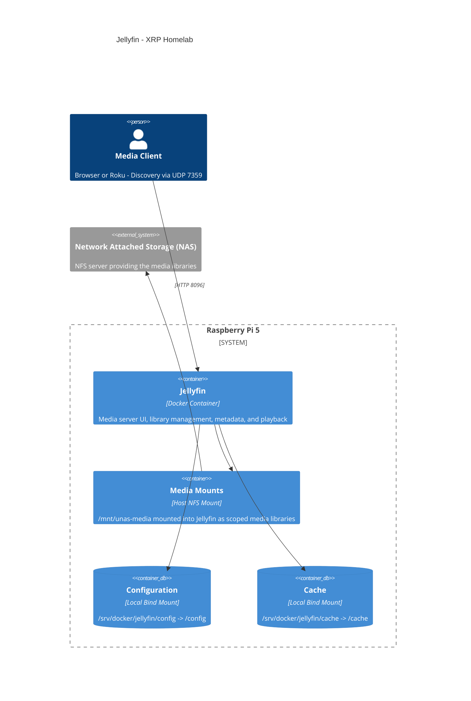
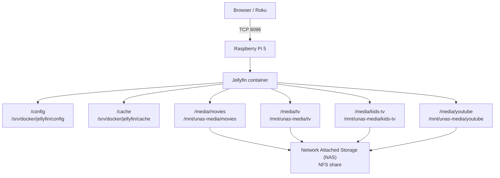

# Jellyfin

Jellyfin is the media server for XRP Homelab. It runs on the Raspberry Pi 5 through Docker Compose, keeps its application state on the Pi SSD, and reads the media libraries from an NFS mount off a NAS.

## Purpose

Jellyfin provides the local web and Roku media interface for movies, TV shows, kids shows, and locally stored YouTube media.

The deployment keeps Jellyfin's database and cache on the Pi while the media itself stays on the network attached storage.

## Deployment

| Item | Value |
| --- | --- |
| Platform | Raspberry Pi 5 (ARM64) |
| Deployment method | Docker Compose |
| Image | `jellyfin/jellyfin:12.0.20260908-012347` |
| Installed server version | `12.0.0` |
| Compose project | `jellyfin` |
| Container | `jellyfin` |
| Runtime UID/GID | `1000:1000` |

The pinned image publishes an ARM64 build and was pulled and verified as `linux/arm64` on the XRP Homelab host.

## Architecture


>**Note** After 8 failed attempts at the above C4 container, I had ChatGPT fine tune it for me

<details>
<summary><strong>Flowchart in case the above diagram does not render correctly</strong></summary>



</details>

Docker uses the default Compose bridge network. Host networking is not used.

## Directory Structure

Deployment definition:

```text
/opt/stacks/jellyfin/
└── compose.yaml
```

Local persistent data:

```text
/srv/docker/jellyfin/
├── config/
└── cache/
```

Host media mount:

```text
/mnt/unas-media/
├── movies/
├── tv/
├── kids-tv/
└── youtube/
```

## Docker Compose

Local deployment definition:

```text
/opt/stacks/jellyfin/compose.yaml
```

Sanitized deployed configuration:

```yaml
services:
  jellyfin:
    image: jellyfin/jellyfin:12.0.20260908-012347
    container_name: jellyfin
    user: "1000:1000"
    restart: unless-stopped

    ports:
      - "8096:8096/tcp"
      - "7359:7359/udp"

    volumes:
      - /srv/docker/jellyfin/config:/config
      - /srv/docker/jellyfin/cache:/cache

      - type: bind
        source: /mnt/unas-media/movies
        target: /media/movies

      - type: bind
        source: /mnt/unas-media/tv
        target: /media/tv

      - type: bind
        source: /mnt/unas-media/kids-tv
        target: /media/kids-tv

      - type: bind
        source: /mnt/unas-media/youtube
        target: /media/youtube
```

No `.env` file is required by the current deployment.

## Ports

| Host Port | Container Port | Protocol | Purpose |
| ---: | ---: | --- | --- |
| `8096` | `8096` | TCP | Jellyfin HTTP interface and media access |
| `7359` | `7359` | UDP | Jellyfin client discovery on the local network |

Port `8920/tcp` is not published because Jellyfin's built-in HTTPS listener is not used by this deployment.

## Persistent Storage

| Host Path | Container Path | Contents |
| --- | --- | --- |
| `/srv/docker/jellyfin/config` | `/config` | Database, server configuration, users, plugins, metadata, logs, and backup data |
| `/srv/docker/jellyfin/cache` | `/cache` | Cache and transient application data |
| `/mnt/unas-media/movies` | `/media/movies` | Movies and local sidecar metadata/artwork |
| `/mnt/unas-media/tv` | `/media/tv` | TV shows and local sidecar metadata/artwork |
| `/mnt/unas-media/kids-tv` | `/media/kids-tv` | Kids shows and local sidecar metadata/artwork |
| `/mnt/unas-media/youtube` | `/media/youtube` | Locally stored YouTube media and sidecar metadata/artwork |

The recommended setup when mounting media is read only, however the media mounts in this deployment are intentionally read-write. Jellyfin is configured to save local metadata and artwork beside media, so it needs permission to create files in those library directories.

## Networking

Jellyfin uses Docker's default bridge network and publishes only the ports needed by the current deployment.

Local clients connect to the Raspberry Pi on TCP `8096`. UDP `7359` is exposed for client discovery.

DLNA is not part of this deployment. Jellyfin documents host networking as required for DLNA in its container setup, and this stack intentionally does not use host networking.

## Configuration

| Setting | Value | Reason |
| --- | --- | --- |
| Container user | `1000:1000` | Runs Jellyfin as a non-root user |
| Restart policy | `unless-stopped` | Matches XRP Homelab container policy |
| Local config | `/srv/docker/jellyfin/config` | Keeps the database and server state on the Pi SSD |
| Local cache | `/srv/docker/jellyfin/cache` | Keeps cache activity off the network media share |
| Media mount | `/mnt/unas-media` | Provides the host-side NFS media tree |
| Movie library | `/media/movies` | Container path for movies |
| TV library | `/media/tv` | Container path for shows |
| Kids library | `/media/kids-tv` | Container path for kids shows |
| YouTube library | `/media/youtube` | Container path for locally stored YouTube media |
| NFO saver | Enabled for media libraries | Saves portable metadata beside media |
| Save artwork into media folders | Enabled | Keeps selected artwork with the media files |

## Initial Deployment

This procedure assumes Docker and Docker Compose are already installed on the XRP Homelab host. It also assumes the NFS server already exports the media share and grants the Pi read-write access to the library directories.

### 1. Check architecture and port conflicts

```bash
uname -m

sudo ss -ltnp | grep ':8096 ' || true
sudo ss -lunp | grep ':7359 ' || true

docker ps -a --filter 'name=jellyfin'
```

The host should report `aarch64`.

### 2. Install the NFS client and mount the media share

Install the NFS client:

```bash
sudo apt update
sudo apt install -y nfs-common
```

Create the mount point:

```bash
sudo mkdir -p /mnt/unas-media
```

Add the following line once to `/etc/fstab`, replacing `<NAS-IP>` with the storage server address:

```fstab
<NAS-IP>:/var/nfs/shared/media /mnt/unas-media nfs defaults,_netdev,nofail,x-systemd.automount 0 0
```

Reload systemd and verify the mount:

```bash
sudo systemctl daemon-reload
sudo mount /mnt/unas-media

findmnt /mnt/unas-media
ls -lah /mnt/unas-media
```

Verify that the expected library directories exist:

```bash
ls -ld \
  /mnt/unas-media/movies \
  /mnt/unas-media/tv \
  /mnt/unas-media/kids-tv \
  /mnt/unas-media/youtube
```

The NFS share must allow writes if Jellyfin will save NFO files and artwork beside media.

### 3. Create deployment and persistent-data directories

```bash
sudo mkdir -p /opt/stacks/jellyfin
sudo mkdir -p /srv/docker/jellyfin/config
sudo mkdir -p /srv/docker/jellyfin/cache

sudo chown -R 1000:1000 /srv/docker/jellyfin
sudo chmod 755 \
  /srv/docker/jellyfin \
  /srv/docker/jellyfin/config \
  /srv/docker/jellyfin/cache
```

### 4. Install the Compose definition

Copy the repository's `compose.yaml` to:

```text
/opt/stacks/jellyfin/compose.yaml
```

### 5. Validate

```bash
cd /opt/stacks/jellyfin
docker compose config
```

Confirm the resolved configuration contains:

- `jellyfin/jellyfin:12.0.20260908-012347`
- TCP `8096`
- UDP `7359`
- `/srv/docker/jellyfin/config:/config`
- `/srv/docker/jellyfin/cache:/cache`
- the four `/mnt/unas-media/...` media mounts
- `user: 1000:1000`
- `restart: unless-stopped`

Resolve validation errors before continuing.

### 6. Pull the image

```bash
docker compose pull
```

Verify the pulled image architecture:

```bash
docker image inspect jellyfin/jellyfin:12.0.20260908-012347 \
  --format 'OS={{.Os}} Architecture={{.Architecture}}'
```

Expected:

```text
OS=linux Architecture=arm64
```

### 7. Deploy

```bash
docker compose up -d
docker compose ps
docker compose logs --tail=100
```

Wait for Jellyfin to complete startup. `docker compose ps` should eventually report the container as healthy.

### 8. Verify storage access

Confirm the persistent paths are mounted as expected:

```bash
docker inspect jellyfin --format \
'{{range .Mounts}}{{println .Source "->" .Destination "RW=" .RW}}{{end}}'
```

Verify Jellyfin can create and remove files in each media library:

```bash
docker compose exec jellyfin sh -lc '
for d in movies tv kids-tv youtube; do
    f="/media/$d/.jellyfin-write-test"

    if printf "Jellyfin write test\n" > "$f" && rm "$f"; then
        echo "$d: WRITE/DELETE OK"
    else
        echo "$d: FAILED"
    fi
done
'
```

All four directories should report `WRITE/DELETE OK`.

### 9. Complete the Jellyfin setup wizard

Open:

```text
http://<PI-IP>:8096
```

You should be greeted with this screen.


Create the administrator account and add these libraries:

| Library | Container Path |
| --- | --- |
| Movies | `/media/movies` |
| Shows | `/media/tv` |
| Kids Shows | `/media/kids-tv` |
| YouTube | `/media/youtube` |

For libraries where metadata should remain portable with the media:

- enable the `Nfo` metadata saver
- enable `Save artwork into media folders`

Allow the initial library scan to complete before judging client performance. A first scan can generate short periods of high CPU and heavy media-share activity.

### 10. Verify the service

Check the local HTTP endpoint:

```bash
curl --max-time 5 -sS -o /dev/null \
  -w 'HTTP %{http_code} time=%{time_total}s\n' \
  http://127.0.0.1:8096/
```

A redirect response such as `HTTP 302` confirms the local web endpoint is answering.

Check recent errors:

```bash
docker compose logs --since=10m \
  | grep -Ei 'error|exception|fatal|permission denied|unauthorizedaccess' \
  | tail -100 || true
```

Confirm the web interface and at least one media client can browse a library and start playback.

### 11. Verify in Portainer

Confirm Portainer automatically shows:

- Compose project `jellyfin`
- container `jellyfin`
- published ports `8096/tcp` and `7359/udp`
- the expected bind mounts
- healthy container state

No separate Portainer deployment is required.

## Access

Local web interface:

```text
http://<PI-IP>:8096
```

The current Compose definition does not publish Jellyfin directly to the public Internet.

## Portainer

Docker Compose owns the deployment definition. Portainer reads the resulting Docker state and is used for status, logs, resource use, console access, networks, mounts, and routine troubleshooting.

Do not recreate or redefine Jellyfin through Portainer's Add Container workflow.

## Backup

The minimum Jellyfin service backup scope is:

```text
/srv/docker/jellyfin/config
```

This contains the Jellyfin database and server state. `/srv/docker/jellyfin/cache` is disposable and does not need to be restored.

Jellyfin 12 also includes a built-in backup feature under the administrative Dashboard. For the official Docker image, built-in backup archives are stored below the `/config` volume, normally:

```text
/srv/docker/jellyfin/config/data/backups
```

A backup stored only there is still on the same host, so copy backup archives off the Pi as part of the homelab backup process.

For a manual filesystem backup, stop Jellyfin before copying `/config`:

```bash
cd /opt/stacks/jellyfin
docker compose stop jellyfin

sudo tar -C /srv/docker/jellyfin \
  -czf /path/to/backup/jellyfin-config-$(date +%Y%m%d-%H%M%S).tar.gz \
  config

docker compose start jellyfin
```

The media libraries under `/mnt/unas-media` are separate from the Jellyfin service backup. Media files, NFO files, and artwork stored beside the media must be protected by the storage system's own backup or snapshot plan.

## Restore

For a clean-host restore:

1. Install Docker, Docker Compose, and `nfs-common`.
2. Recreate `/mnt/unas-media` and the NFS `/etc/fstab` entry from the Initial Deployment section.
3. Verify all four media directories are mounted and accessible.
4. Recreate the Jellyfin directories:

   ```bash
   sudo mkdir -p /opt/stacks/jellyfin
   sudo mkdir -p /srv/docker/jellyfin/config
   sudo mkdir -p /srv/docker/jellyfin/cache
   ```

5. Restore the backed-up `config` directory to:

   ```text
   /srv/docker/jellyfin/config
   ```

6. Restore ownership:

   ```bash
   sudo chown -R 1000:1000 /srv/docker/jellyfin
   ```

7. Place the repository's `compose.yaml` at:

   ```text
   /opt/stacks/jellyfin/compose.yaml
   ```

8. Validate:

   ```bash
   cd /opt/stacks/jellyfin
   docker compose config
   ```

9. Pull the pinned image:

   ```bash
   docker compose pull
   ```

10. Deploy and verify:

    ```bash
    docker compose up -d
    docker compose ps
    docker compose logs --tail=100
    ```

11. Open `http://<PI-IP>:8096` and verify users, libraries, metadata, and playback.

If the backup was taken before a major Jellyfin upgrade, restore it against the matching Jellyfin version first. Jellyfin applies database migrations during upgrades and does not provide a general downgrade path.

## Update Procedure

Jellyfin is pinned to an exact image build. Do not change the tag without reviewing the upstream release notes first.

Before a major upgrade, create a Jellyfin backup or stop the service and back up `/srv/docker/jellyfin/config`.

Update the image tag in:

```text
/opt/stacks/jellyfin/compose.yaml
```

Then validate, pull, and redeploy:

```bash
cd /opt/stacks/jellyfin

docker compose config
docker compose pull
docker compose up -d

docker compose ps
docker compose logs --tail=100
```

Verify:

- the container becomes healthy
- the web interface opens
- libraries load
- playback works on a normal client
- no recurring database, permission, or filesystem errors appear in the logs

Do not downgrade to an older image after a database migration unless the matching pre-upgrade Jellyfin backup is also restored.

## Security Considerations

Jellyfin runs as non-root UID/GID `1000:1000`.

The deployment does not use:

- `privileged: true`
- Docker socket access
- host networking
- host-device mappings
- elevated Linux capabilities

TCP `8096` is plain HTTP. Keep it on trusted local/private networks unless a separate secure remote-access layer is deliberately configured.

The four media mounts are read-write so Jellyfin can save NFO metadata and artwork beside media. That also means the Jellyfin process can modify or delete content in those four directories. Do not grant it access to unrelated storage paths.

## Troubleshooting

### Metadata or artwork cannot be saved beside media

**Symptom**

Jellyfin can browse and play media but logs `Permission denied` or `UnauthorizedAccessException` when trying to create `.nfo` or artwork files.

**Cause**

The NFS export or directory permissions allow reads but do not allow the mapped Jellyfin/NFS identity to create files inside one or more media directories.

**Resolution**

Test the exact library path from inside the container:

```bash
docker compose exec jellyfin sh -lc '
f="/media/movies/.jellyfin-write-test"
printf "test\n" > "$f" &&
rm "$f" &&
echo "WRITE/DELETE OK"
'
```

Fix the storage-side permissions or export configuration rather than making the Jellyfin container privileged or applying `chmod 777`.

### Web interface is slow during the initial scan

**Symptom**

The UI or a media client responds slowly while the first library scan is running.

**Cause**

The initial scan performs library discovery, metadata work, database updates, and media probing at the same time.

**Resolution**

Allow the initial scan to finish, then retest while Jellyfin is idle:

```bash
docker stats --no-stream jellyfin
```

A short CPU burst when opening a large library is normal. Persistent slowness after the scan should be investigated separately.

## References

- Jellyfin container installation: https://jellyfin.org/docs/general/installation/container/
- Jellyfin networking and ports: https://jellyfin.org/docs/general/post-install/networking/
- Jellyfin backup and restore: https://jellyfin.org/docs/general/administration/backup-and-restore/
- Jellyfin local NFO metadata: https://jellyfin.org/docs/general/server/metadata/nfo/
- Jellyfin 12.0 release notes: https://jellyfin.org/posts/jellyfin-release-12.0/
- Official Docker image tags: https://hub.docker.com/r/jellyfin/jellyfin/tags

